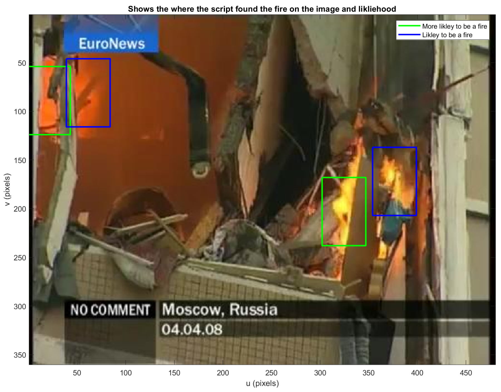
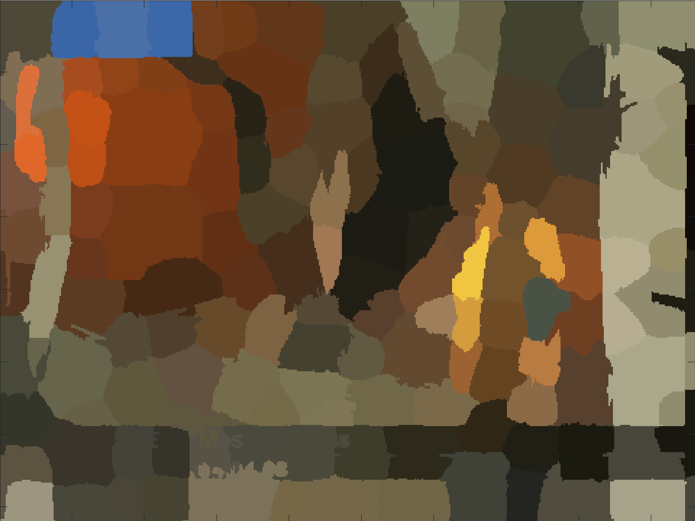

# 🔥 Fire Detection Model

This project implements a color-based fire detection model using image segmentation and heuristic classification.  
It was built in MATLAB to analyze individual video frames for potential fire regions based on color spectra and visual structure.

The model segments the input image using superpixels, isolates fire-like colors (e.g. orange/yellow hues), and evaluates how likely a region is to be actual fire based on local color variation — a simple proxy for flame dynamics.

---

## 🔧 Features

- Fire region segmentation using superpixels
- Custom rule-based color filter for fire-like regions
- Likelihood classification based on color diversity
- Visualization of bounding boxes with confidence level
- Modular pipeline for frame-by-frame analysis
- Easily extendable to full video stream processing

---

## 📊 Results

### 🔹 Fire Detection Output (with Likelihood Overlay)

Green boxes = higher likelihood of fire  
Blue boxes = possible fire based on color

---

### 🔹 Superpixel-Based Color Segmentation

Fire-like colors are grouped into regions and filtered before final analysis.

---

## 🧠 Why It Matters

This project demonstrates a lightweight, interpretable method for fire detection using color segmentation alone — without any machine learning or pre-trained models. It highlights the effectiveness of handcrafted feature pipelines in solving real-world visual detection tasks.

While this demo runs on a single frame, the architecture is modular and easily extendable to full video input. The only reason full video support wasn't implemented here was to avoid overloading local compute resources — but you can enable real-time frame scanning with minor updates to the `main.m` script and video frame loop logic.

---

## 🖥️ How to Run

1. Open `src/main.m` in MATLAB
2. Place your video/image file in the working directory
3. Adjust frame index (`n`) in the script to choose your test image
4. Run to see bounding boxes and segmentation results

---

## 📁 Project Structure
src/ ├── main.m # Entry point for the pipeline ├── fireSeg.m # Fire segmentation using superpixels + color filtering ├── isFire.m # Likelihood check for multi-colored regions ├── vid2img.m # Extracts frames from video ├── VideoCutter.m # (Optional) Cuts input video to 12s sample

results/ ├── Fire_detect.png # Sample output with fire boxes ├── frontPage.PNG # Color segmentation output

---

## 📌 Notes

This project was originally built for a university assignment.  
All key logic — segmentation, likelihood evaluation, and visualization — was implemented individually.

